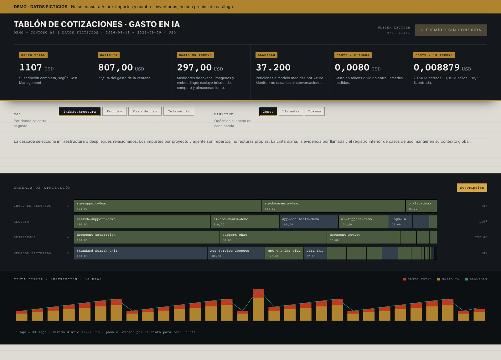

# Azure AI FinOps Dashboard

Dashboard local para entender el gasto de Azure AI: costes, llamadas, tokens,
despliegues, agentes y casos de uso. Cruza Cost Management, Azure Monitor,
Microsoft Foundry, Application Insights y API Management.

**Herramienta de referencia, no un servicio multiusuario ni una factura por agente.**
Los costes atribuidos y los repartos se distinguen de las mediciones directas.



La captura se genera con `npm run demo`. Todos sus nombres e importes son ficticios;
no son datos anonimizados de un cliente ni precios de catalogo.

## 1. Descargar y probar sin Azure

Necesitas [Node.js 22.9 o superior](https://nodejs.org/) y Git. Se recomienda Node 22 LTS.
Comprueba la version con `node --version`. En macOS y Linux, si usas nvm, puedes ejecutar `nvm use`.

```bash
git clone https://github.com/jrubiosainz/azure-ai-finops-dashboard.git
cd azure-ai-finops-dashboard
npm ci
npm run demo
```

Abre **http://127.0.0.1:5173**. Para detenerlo, pulsa **Ctrl+C** en la terminal.

La demo funciona sin Azure CLI, credenciales, suscripcion ni conexion a Azure.
No provisiona recursos, no genera peticiones a modelos y no tiene coste de Azure.
La instalacion inicial de dependencias si necesita acceso a npm.

## 2. Conectar tu propia suscripcion

El dashboard consulta recursos **ya existentes**. No crea cuentas, modelos, agentes,
pasarelas ni telemetria. No necesitas todos esos servicios para ver el gasto:
las secciones opcionales pueden aparecer vacias o con avisos.

1. Instala [Azure CLI](https://learn.microsoft.com/cli/azure/install-azure-cli) e inicia sesion:

   ```bash
   az login
   az account list --output table
   ```

2. Copia `.env.example` como `.env`, en la raiz del repositorio. En macOS/Linux:

   ```bash
   cp .env.example .env
   ```

   En PowerShell:

   ```powershell
   Copy-Item .env.example .env
   ```

3. Edita `.env` y pega el **ID** de la suscripcion que quieres consultar, no su nombre:

   ```dotenv
   AZURE_SUBSCRIPTION_ID=PEGA_AQUI_EL_ID_DE_TU_SUSCRIPCION
   FINOPS_DAYS=30
   PORT=5173
   FINOPS_DEMO=false
   ```

   No hay ninguna suscripcion predeterminada. La configuracion incorrecta detiene el
   arranque con un mensaje explicativo. No pongas claves de modelos ni contrasenas en este archivo.

4. Deten la demo si sigue abierta y arranca con datos reales:

   ```bash
   npm start
   ```

   Este comando **compila y sirve la interfaz automaticamente**. Abre
   **http://127.0.0.1:5173** y espera la primera sincronizacion: suele tardar unos minutos
   y puede tardar mas con muchas cuentas o limites de Azure.

Si tu identidad pertenece a varios tenants, usa `az login --tenant ID_DEL_TENANT`
y configura tambien `AZURE_TENANT_ID` en `.env`. Selecciona la suscripcion correspondiente
con `az account set --subscription ID_DE_LA_SUSCRIPCION` cuando sea necesario.
El dashboard utiliza siempre `AZURE_SUBSCRIPTION_ID`, no deduce el destino de tu cuenta activa.

### Permisos

La identidad de Azure CLI necesita acceso a las fuentes que vaya a leer. Un administrador
debe conceder los roles de menor privilegio adecuados a cada ambito:

| Fuente | Acceso necesario |
|---|---|
| Inventario y metricas | Lectura de la suscripcion y sus recursos, por ejemplo `Reader`. |
| Cost Management | Lectura de costes, por ejemplo `Cost Management Reader`; la politica de facturacion del contrato tambien debe permitirla. |
| Agentes de Foundry | Permisos de plano de datos para listar agentes en los proyectos; segun el tipo de cuenta, `Azure AI User` o `Cognitive Services User`. `Reader` de ARM por si solo no garantiza este acceso. |
| Application Insights / Log Analytics, opcional | Lectura de los componentes y permiso de consulta sobre los workspaces, por ejemplo `Log Analytics Reader`. |
| API Management, opcional | Lectura del servicio, named values no secretos, etiquetas, enlaces e informes. El dashboard no solicita claves de suscripciones de APIM. |

Mas detalle, limites de compatibilidad y configuracion opcional en
[Configuracion de Azure](docs/azure-setup.md).

## Configuracion

`.env` se carga al ejecutar los comandos npm. Las variables ya exportadas en la terminal
tienen prioridad. Reinicia el proceso despues de cambiar la configuracion.

| Variable | Valor predeterminado | Descripcion |
|---|---|---|
| `AZURE_SUBSCRIPTION_ID` | Ninguno | ID obligatorio para datos reales. |
| `AZURE_TENANT_ID` | Contexto de Azure CLI | Tenant de la credencial, si necesitas fijarlo. |
| `FINOPS_DAYS` | `30` | Entre 1 y 90 dias naturales, incluidos ambos extremos, terminando hoy en UTC. Hoy puede estar incompleto. |
| `PORT` | `5173` | Puerto local de la API y la interfaz compilada. |
| `FINOPS_DEMO` | `false` | Datos sinteticos sin Azure. `npm run demo` lo activa para esa ejecucion. |

La interfaz trabaja con la moneda devuelta por Cost Management, sin convertir divisas.
Se mantiene una sola suscripcion configurada por proceso.

## Uso y procedencia de las cifras

| Seccion | De donde sale y que significa |
|---|---|
| Gasto total / IA | Cost Management `ActualCost`. IA es una clasificacion de servicios, no el coste total de negocio de cada aplicacion de IA. |
| Gasto en tokens | Medidores clasificados como tokens, imagenes y embeddings. No incluye automaticamente busqueda, computo alojado, voz ni almacenamiento. |
| Llamadas y tokens | Azure Monitor; se enlazan con los despliegues inventariados. No son usuarios ni conversaciones. |
| Tarifas efectivas | Coste dividido entre llamadas o tokens; son medias de la ventana, no tarifas de catalogo. |
| Despliegues | Inventario de Azure. Su coste se atribuye desde medidores por cuenta y modelo segun la cuota de tokens. |
| Agentes / proyectos | Inventario de Foundry y reparto estimado. Las trazas no corrigen automaticamente ese reparto. |
| Medidores | Conceptos facturados, agrupados por recurso y nombre de medidor. Modelo y sentido se interpretan a partir del nombre. |
| Evidencia por llamada | Registros GenAI de Application Insights. Pueden incluir varios spans o eventos de una misma peticion. Su coste mostrado es una estimacion con la tarifa media global. |
| Casos de uso | Pertenencia declarada en APIM, costes derivados de despliegues y contadores de la pasarela. No incluyen todo el coste de operar la aplicacion. |

La cascada permite recorrer infraestructura, Foundry, casos de uso o la muestra de
telemetria. **La cinta diaria, la evidencia por llamada y el registro inferior de casos
de uso mantienen su contexto global**, indicado en pantalla. En un corte por proyecto
o agente, la cabecera muestra el importe de los despliegues relacionados, no una factura
individual del agente. Al seleccionar un medidor no se inventan llamadas ni tarifas
especificas de ese medidor.

Cost Management no ofrece una dimension directa de despliegue. Los medidores de un modelo
pueden abarcar varios despliegues de una cuenta. Las tarifas mezclan modelos, modalidades
y posibles ajustes: no deben usarse como un contrato de precios ni para chargeback sin
conciliar previamente las fuentes.

## Sincronizacion y datos locales

La primera visita sin cache sincroniza Azure. Despues, **Releer Azure** fuerza una nueva
lectura. Cost Management limita las consultas y sus datos pueden llegar con retraso.
No es monitorizacion en tiempo real; se muestra la fecha de lectura y se marca como
caducada tras cuatro horas.

La cache se guarda en `.cache/`, separada por suscripcion y ventana. Un error al leer
los costes principales no se sustituye por una factura a cero. Los errores de fuentes
opcionales se muestran como avisos. Puedes sincronizar sin abrir el navegador:

```bash
npm run sync
```

**`.env`, `.cache/` y la sesion de Azure CLI son locales y no se deben publicar.**
La cache contiene informacion financiera y nombres de recursos; protegela como cualquier
exportacion de costes. No subas capturas de datos reales sin autorizacion.

## Problemas frecuentes

| Sintoma | Que hacer |
|---|---|
| Node incompatible o `--env-file-if-exists` desconocido | Usa Node 22.9 o superior y vuelve a ejecutar `npm ci`. |
| Falta `AZURE_SUBSCRIPTION_ID` | Copia `.env.example`, edita el ID y reinicia; o usa `npm run demo`. |
| No se puede leer Azure / error 401 o 403 | Renueva `az login`, revisa tenant, ID y permisos. Algunos permisos de costes dependen del contrato de facturacion. |
| Sincronizacion lenta / error 429 | Espera los reintentos. Evita varios procesos leyendo los costes de la misma suscripcion simultaneamente. |
| Agentes, llamadas o tokens vacios | Revisa los avisos, tipo de cuenta, metricas publicadas, permisos y actividad en la ventana. Ausencia de datos no demuestra coste cero. |
| No hay evidencia por llamada | Las aplicaciones deben emitir GenAI hacia los workspaces consultables; instalar este dashboard no instrumenta aplicaciones. |
| No aparecen casos de uso | Es opcional: configura el registro y etiquetas de APIM descritos en la guia. |
| Puerto ocupado | Deten tu proceso anterior con Ctrl+C o cambia `PORT` en `.env`. No termines procesos de terceros. |
| Se muestra demo cuando esperabas Azure | Revisa `FINOPS_DEMO` tanto en `.env` como en las variables exportadas. Usa `npm start`, no `npm run demo`. |

## Desarrollo

```bash
npm ci
npm test
npm run dev
```

La API escucha en `127.0.0.1:5173` (o `PORT`) y Vite en `127.0.0.1:5174`,
con proxy a la API configurada. No uses `PORT=5174` en desarrollo.
Para desarrollar sin Azure, configura `FINOPS_DEMO=true` en `.env`.
`npm run build` genera `web/dist/`.

## Seguridad de uso y licencia

El servidor escucha **solo en 127.0.0.1**. No tiene login web: `az login` autentica
el backend ante Azure, no a quienes visiten la pagina. No lo publiques mediante un
tunel, ingress, proxy o servidor accesible a otros usuarios sin disenar autenticacion,
autorizacion, aislamiento de datos y una identidad de servicio apropiada.

El codigo se distribuye bajo [licencia MIT](LICENSE), sin garantia.
No es un producto oficial de Microsoft ni un sistema certificado de conciliacion financiera.
Las dependencias conservan sus propias licencias.
